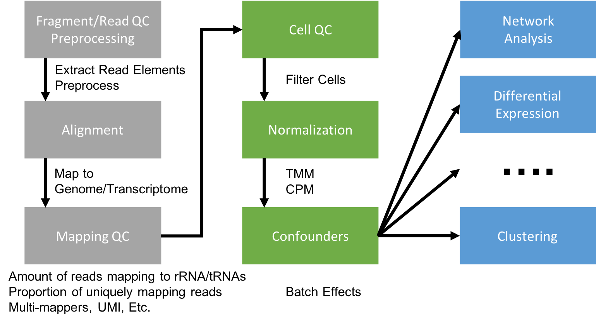

# Closing Thoughts

**The forest through the trees.**

## Prerequisites for bioinformatics

* Access to a multi-core (24 cpu or greater), ‘high’ memory 64Gb or greater Linux server.
* Familiarity with the ’command line’ and at least one programming language.
* Basic knowledge of how to install software
* Basic knowledge of R (or equivalent) and statistical programming
* Basic knowledge of Statistics and model building

## The bottom line

* Spend the time (and money) planning and producing good quality, accurate and sufficient data for your experiment.
* Get to know to your data, develop and test expectations
* Result, you’ll spend much less time (and less money) extracting biological significance and results during analysis.

## Next Steps

My recommendation is to follow all of the instructions **again**, from the beginning on your own. Then again if needed, this time making changes and edits to the code to better understand things.
