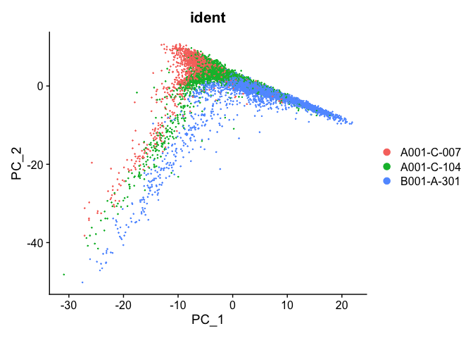
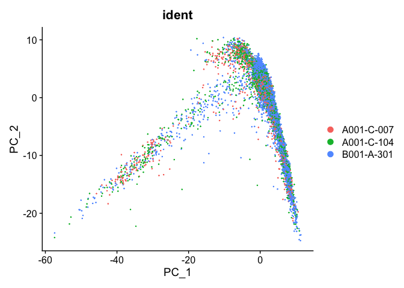

Last Updated: July 15, 2022

# Part 3: Integrate multiple single cell samples / batch correction

More and more experiments sequence more than one samples/datasets, such as the data from [Becker et al., 2022](https://www.nature.com/articles/s41588-022-01088-x) that we are using. It is important to properly integrate these datasets, and we will see the effect the integration has at the end of this documentation.

Most of the methods that were developed to integrate single cell datasets fall into two categories. The first is the "anchor" based approach. In this approach, the first step is to select a batch as the "anchor" and convert other batches to the "anchor" batch. Among this approach, there are [MNN](https://github.com/MarioniLab/MNN2017), [iMAP](https://github.com/Svvord/iMAP), [SCALEX](https://github.com/jsxlei/SCALEX) and [Seurat's integration](https://www.cell.com/cell/fulltext/S0092-8674(19)30559-8). The advantage of this approach is that different batches of cells can be studied under the same experimental conditions, and the disadvantage is that it is not possible to fully combine the features of each batch because the cell types contained in each batch are unknown. The second approach is to transform all batches of data to a low-dimensional space to correct batch effects, such as implemented in [Scanorama](https://github.com/brianhie/scanorama), [Harmony](https://github.com/immunogenomics/harmony), [DESC](https://www.nature.com/articles/s41467-020-15851-3) and [BBKNN](https://github.com/Teichlab/bbknn). This second approach has the advantage of extracting biologically relevant latent features and reducing the impact of noise, but it cannot be used for differential gene expression analysis. Many of these existing methods work well when the batches of datasets have the same cell types, however, they fail when there are different cell types involved in different datasets. Very recently (earlier this year), a [new approach](https://www.mdpi.com/1422-0067/23/4/2082) has been developed that uses connected graphs and generative adversarial networks (GAN) to achieve the goal of eliminating nonbiological noise between batches of datasets. This new method has been demonstrated to work well both in the situation where datasets have the same cell types and in the situation where datasets may have different cell types.


In this workshop, we are going to look at Seurat's integration approach. The basic idea is to identify cross-dataset pairs cells that are in a matched biological state ("anchors"), and use them to correct technical differences between datasets. The integration method we used has been implemented in Seurat and you can find the details of the method in [its publication](https://www.cell.com/cell/fulltext/S0092-8674(19)30559-8).


## Load libraries

```r
library(Seurat)
```

## Load the Seurat object from the provided data and split to individual samples

The provided data is raw data that has only gone through the filtering step.


```r
download.file("https://bioshare.bioinformatics.ucdavis.edu/bioshare/download/feb28v7lew62um4/sample_filtered.RData", "sample_filtered.RData")
```


```r
load(file="sample_filtered.RData")
experiment.aggregate
```

```
## An object of class Seurat 
## 21005 features across 10595 samples within 1 assay 
## Active assay: RNA (21005 features, 0 variable features)
```

```r
experiment.split <- SplitObject(experiment.aggregate, split.by = "ident")
```

## Normalize and find variable features for each individual sample

By default, we employ a global-scaling normalization method LogNormalize that normalizes the gene expression measurements for each cell by the total expression, multiplies this by a scale factor (10,000 by default), and then log-transforms the data.


```r
?NormalizeData
```

The function FindVariableFeatures identifies the most highly variable genes (default 2000 genes) by fitting a line to the relationship of log(variance) and log(mean) using loess smoothing, uses this information to standardize the data, then calculates the variance of the standardized data.  This helps avoid selecting genes that only appear variable due to their expression level.


```r
?FindVariableFeatures
```

Now, let's carry out these two processes for each sample


```r
experiment.split <- lapply(X = experiment.split, FUN=function(x){
  x <- NormalizeData(x)
  x <- FindVariableFeatures(x, selection.method = "vst", nfeatures = 2000)
})
```

## Select features that are repeatedly variable across samples and find integration anchors


```r
features <- SelectIntegrationFeatures(object.list = experiment.split)
anchors <- FindIntegrationAnchors(object.list = experiment.split, anchor.features = features)
```


## Perform integration


```r
experiment.integrated <- IntegrateData(anchorset = anchors)
```


#### Question(s)

1. Explore the object "experiment.integrated" to see what information is available.

## PCA plot before integration


```r
experiment.test <- NormalizeData(object=experiment.integrated, assay="RNA")
experiment.test <- ScaleData(object=experiment.test, assay="RNA")
experiment.test <- FindVariableFeatures(object=experiment.test, assay="RNA")
experiment.test <- RunPCA(object=experiment.test, assay="RNA")
DimPlot(object = experiment.test, group.by="ident", reduction="pca", shuffle=TRUE)
```

<!-- -->

## PCA plot after integration


```r
experiment.test <- ScaleData(object=experiment.integrated, assay="integrated")
experiment.test <- FindVariableFeatures(object=experiment.test, assay="integrated")
experiment.test <- RunPCA(object=experiment.test, assay="integrated")
DimPlot(object = experiment.test, group.by="ident", reduction="pca", shuffle=TRUE)
```

<!-- -->

## Save the integrated data


```r
save(experiment.integrated, file="sample_integrated.RData")
```

## Get the next Rmd file

```r
download.file("https://raw.githubusercontent.com/msettles/2022-Uganda-Single-Cell-RNA-Seq-Analysis/main/data_analysis/scRNA_Workshop-PART4.Rmd", "scRNA_Workshop-PART4.Rmd")
```

## Session Information

```r
sessionInfo()
```

```
## R version 4.1.2 (2021-11-01)
## Platform: x86_64-apple-darwin17.0 (64-bit)
## Running under: macOS Catalina 10.15.7
## 
## Matrix products: default
## BLAS:   /Library/Frameworks/R.framework/Versions/4.1/Resources/lib/libRblas.0.dylib
## LAPACK: /Library/Frameworks/R.framework/Versions/4.1/Resources/lib/libRlapack.dylib
## 
## locale:
## [1] en_US.UTF-8/en_US.UTF-8/en_US.UTF-8/C/en_US.UTF-8/en_US.UTF-8
## 
## attached base packages:
## [1] stats     graphics  grDevices utils     datasets  methods   base     
## 
## other attached packages:
## [1] SeuratObject_4.0.4 Seurat_4.1.0      
## 
## loaded via a namespace (and not attached):
##   [1] Rtsne_0.15            colorspace_2.0-2      deldir_1.0-6         
##   [4] ellipsis_0.3.2        ggridges_0.5.3        rstudioapi_0.13      
##   [7] spatstat.data_2.1-2   farver_2.1.0          leiden_0.3.9         
##  [10] listenv_0.8.0         ggrepel_0.9.1         fansi_1.0.2          
##  [13] codetools_0.2-18      splines_4.1.2         knitr_1.37           
##  [16] polyclip_1.10-0       jsonlite_1.8.0        ica_1.0-2            
##  [19] cluster_2.1.2         png_0.1-7             uwot_0.1.11          
##  [22] shiny_1.7.1           sctransform_0.3.3     spatstat.sparse_2.1-0
##  [25] compiler_4.1.2        httr_1.4.2            assertthat_0.2.1     
##  [28] Matrix_1.4-0          fastmap_1.1.0         lazyeval_0.2.2       
##  [31] cli_3.2.0             later_1.3.0           htmltools_0.5.2      
##  [34] tools_4.1.2           igraph_1.2.11         gtable_0.3.0         
##  [37] glue_1.6.2            RANN_2.6.1            reshape2_1.4.4       
##  [40] dplyr_1.0.8           Rcpp_1.0.8.3          scattermore_0.7      
##  [43] jquerylib_0.1.4       vctrs_0.3.8           nlme_3.1-155         
##  [46] lmtest_0.9-39         xfun_0.29             stringr_1.4.0        
##  [49] globals_0.14.0        mime_0.12             miniUI_0.1.1.1       
##  [52] lifecycle_1.0.1       irlba_2.3.5           goftest_1.2-3        
##  [55] future_1.23.0         MASS_7.3-55           zoo_1.8-9            
##  [58] scales_1.1.1          spatstat.core_2.3-2   promises_1.2.0.1     
##  [61] spatstat.utils_2.3-0  parallel_4.1.2        RColorBrewer_1.1-2   
##  [64] yaml_2.3.5            reticulate_1.24       pbapply_1.5-0        
##  [67] gridExtra_2.3         ggplot2_3.3.5         sass_0.4.0           
##  [70] rpart_4.1.16          stringi_1.7.6         highr_0.9            
##  [73] rlang_1.0.2           pkgconfig_2.0.3       matrixStats_0.61.0   
##  [76] evaluate_0.14         lattice_0.20-45       ROCR_1.0-11          
##  [79] purrr_0.3.4           tensor_1.5            labeling_0.4.2       
##  [82] patchwork_1.1.1       htmlwidgets_1.5.4     cowplot_1.1.1        
##  [85] tidyselect_1.1.2      parallelly_1.30.0     RcppAnnoy_0.0.19     
##  [88] plyr_1.8.6            magrittr_2.0.2        R6_2.5.1             
##  [91] generics_0.1.2        DBI_1.1.2             mgcv_1.8-38          
##  [94] pillar_1.7.0          fitdistrplus_1.1-6    survival_3.2-13      
##  [97] abind_1.4-5           tibble_3.1.6          future.apply_1.8.1   
## [100] crayon_1.5.0          KernSmooth_2.23-20    utf8_1.2.2           
## [103] spatstat.geom_2.3-1   plotly_4.10.0         rmarkdown_2.11       
## [106] grid_4.1.2            data.table_1.14.2     digest_0.6.29        
## [109] xtable_1.8-4          tidyr_1.2.0           httpuv_1.6.5         
## [112] munsell_0.5.0         viridisLite_0.4.0     bslib_0.3.1
```
