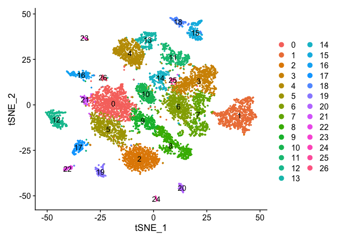
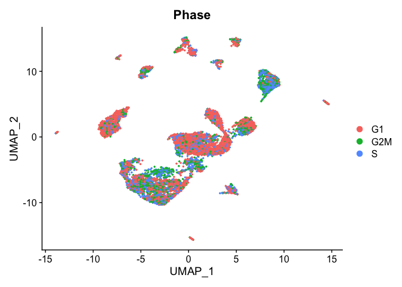
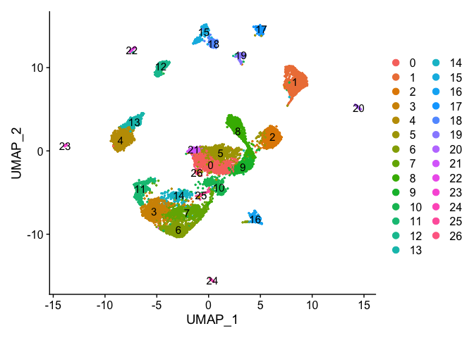
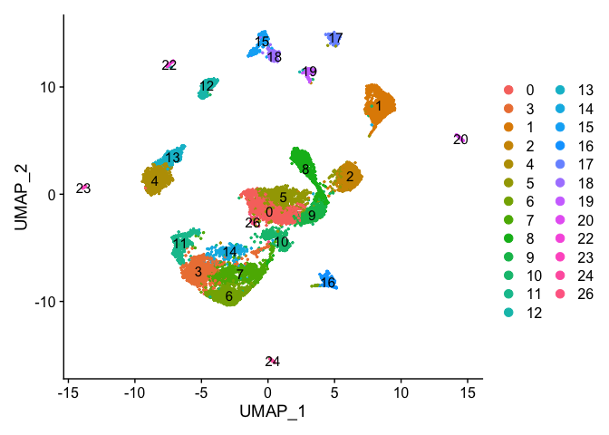
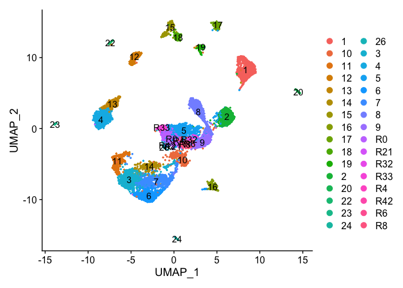
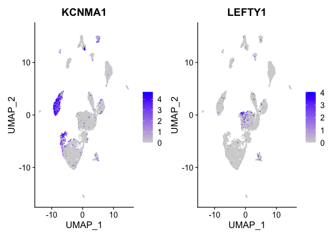
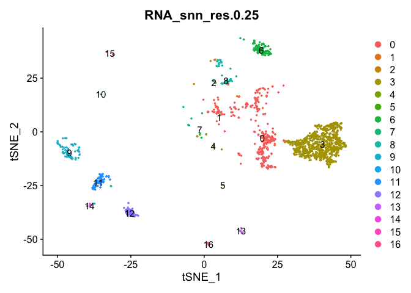
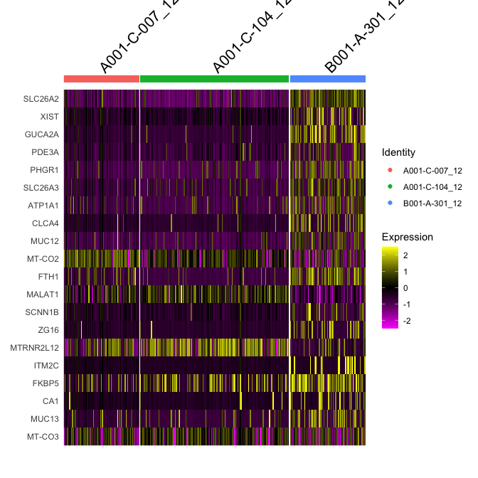

Last Updated: July 20 2022

# Part 5: 

## Load libraries

```r
library(Seurat)
library(ggplot2)
library(dplyr)
```

## Load the Seurat object

```r
load(file="pca_sample_corrected.RData")
experiment.aggregate
```

<div class='r_output'> An object of class Seurat 
 36601 features across 3343 samples within 1 assay 
 Active assay: RNA (36601 features, 3941 variable features)
  1 dimensional reduction calculated: pca
</div>

## So how many features should we use? Use too few and your leaving out interesting variation that may define cell types, use too many and you add in noise? maybe?

Lets choose the first 25, based on our prior part.


```r
use.pcs = 1:25
```

## Identifying clusters

Seurat implements an graph-based clustering approach. Distances between the cells are calculated based on previously identified PCs. 

The default method for identifying k-nearest neighbors has been changed in V4 to [annoy](https://github.com/spotify/annoy) ("Approximate Nearest Neighbors Oh Yeah!). This is an approximate nearest-neighbor approach that is widely used for high-dimensional analysis in many fields, including single-cell analysis. Extensive community benchmarking has shown that annoy substantially improves the speed and memory requirements of neighbor discovery, with negligible impact to downstream results. 


Seurat prior approach was heavily inspired by recent manuscripts which applied graph-based clustering approaches to scRNAseq data. Briefly, Seurat identified clusters of cells by a shared nearest neighbor (SNN) modularity optimization based clustering algorithm. First calculate k-nearest neighbors (KNN) and construct the SNN graph. Then optimize the modularity function to determine clusters. For a full description of the algorithms, see Waltman and van Eck (2013) The European Physical Journal B. You can switch back to using the previous default setting using nn.method="rann".


The FindClusters function implements the neighbor based clustering procedure, and contains a resolution parameter that sets the granularity of the downstream clustering, with increased values leading to a greater number of clusters. I tend to like to perform a series of resolutions, investigate and choose.


```r
?FindNeighbors
```


```r
experiment.aggregate <- FindNeighbors(experiment.aggregate, reduction="pca", dims = use.pcs)

experiment.aggregate <- FindClusters(
    object = experiment.aggregate,
    resolution = seq(0.25,4,0.5),
    verbose = FALSE
)
```


Seurat add the clustering information to the metadata beginning with RNA_snn_res. followed by the resolution


```r
head(experiment.aggregate[[]])
```

<div class='r_output'>                             orig.ident nCount_RNA nFeature_RNA percent.mito
 AAACCTGCAGACTCGC-conv_COVID conv_COVID       7321         2560    0.3824614
 AAACGGGTCTGGGCCA-conv_COVID conv_COVID       6765         2128    0.8869180
 AAACGGGTCTTAGAGC-conv_COVID conv_COVID      11471         2964    0.4794700
 AAAGATGCATCCTAGA-conv_COVID conv_COVID       9610         2605    0.9261186
 AAAGCAAAGAGTAAGG-conv_COVID conv_COVID       7242         2051    0.3314002
 AAAGCAAAGCCTATGT-conv_COVID conv_COVID       1016          772    1.6732283
                                 S.Score    G2M.Score Phase  old.ident
 AAACCTGCAGACTCGC-conv_COVID -0.04879952 -0.026197357    G1 conv_COVID
 AAACGGGTCTGGGCCA-conv_COVID -0.01441873 -0.031983183    G1 conv_COVID
 AAACGGGTCTTAGAGC-conv_COVID -0.05208459 -0.003787519    G1 conv_COVID
 AAAGATGCATCCTAGA-conv_COVID -0.02179640 -0.011175856    G1 conv_COVID
 AAAGCAAAGAGTAAGG-conv_COVID  0.11342246  0.019373865     S conv_COVID
 AAAGCAAAGCCTATGT-conv_COVID  0.03533120 -0.017761709     S conv_COVID
                             RNA_snn_res.0.25 RNA_snn_res.0.75 RNA_snn_res.1.25
 AAACCTGCAGACTCGC-conv_COVID                6                8                8
 AAACGGGTCTGGGCCA-conv_COVID                0                0                0
 AAACGGGTCTTAGAGC-conv_COVID                0                0                0
 AAAGATGCATCCTAGA-conv_COVID                6                8                8
 AAAGCAAAGAGTAAGG-conv_COVID                2                2                2
 AAAGCAAAGCCTATGT-conv_COVID                5                7                7
                             RNA_snn_res.1.75 RNA_snn_res.2.25 RNA_snn_res.2.75
 AAACCTGCAGACTCGC-conv_COVID                9                8                6
 AAACGGGTCTGGGCCA-conv_COVID                3                1               13
 AAACGGGTCTTAGAGC-conv_COVID                3                1                1
 AAAGATGCATCCTAGA-conv_COVID                9                8                6
 AAAGCAAAGAGTAAGG-conv_COVID                1                3                2
 AAAGCAAAGCCTATGT-conv_COVID                5                7                5
                             RNA_snn_res.3.25 RNA_snn_res.3.75 seurat_clusters
 AAACCTGCAGACTCGC-conv_COVID                6                6               6
 AAACGGGTCTGGGCCA-conv_COVID               10               11              11
 AAACGGGTCTTAGAGC-conv_COVID               10               11              11
 AAAGATGCATCCTAGA-conv_COVID                6                6               6
 AAAGCAAAGAGTAAGG-conv_COVID                1                0               0
 AAAGCAAAGCCTATGT-conv_COVID                4                5               5
</div>

Lets first investigate how many clusters each resolution produces and set it to the smallest resolutions of 0.5 (fewest clusters).


```r
sapply(grep("res",colnames(experiment.aggregate@meta.data),value = TRUE),
       function(x) length(unique(experiment.aggregate@meta.data[,x])))
```

<div class='r_output'> RNA_snn_res.0.25 RNA_snn_res.0.75 RNA_snn_res.1.25 RNA_snn_res.1.75 
                9               12               14               16 
 RNA_snn_res.2.25 RNA_snn_res.2.75 RNA_snn_res.3.25 RNA_snn_res.3.75 
               20               22               23               23
</div>
### Plot TSNE coloring for each resolution

tSNE dimensionality reduction plots are then used to visualize clustering results. As input to the tSNE, you should use the same PCs as input to the clustering analysis.


```r
experiment.aggregate <- RunTSNE(
  object = experiment.aggregate,
  reduction.use = "pca",
  dims = use.pcs,
  do.fast = TRUE)
```


```r
DimPlot(object = experiment.aggregate, group.by=grep("res",colnames(experiment.aggregate@meta.data),value = TRUE)[1:4], ncol=2 , pt.size=3.0, reduction = "tsne", label = T)
```

<!-- -->


```r
DimPlot(object = experiment.aggregate, group.by=grep("res",colnames(experiment.aggregate@meta.data),value = TRUE)[5:8], ncol=2 , pt.size=3.0, reduction = "tsne", label = T)
```

<!-- -->

1. Try exploring different PCS, so first 5, 10, 15, we used 25, what about 100? How does the clustering change?

Once complete go back to 1:25

### Choosing a resolution

Lets set the default identity to a resolution of 1.25 and produce a table of cluster to sample assignments.

```r
Idents(experiment.aggregate) <- "RNA_snn_res.1.25"
table(Idents(experiment.aggregate),experiment.aggregate$orig.ident)
```

<div class='r_output'>     
      conv_COVID conv_MMR conv_Tdap norm_COVID
   0         180      217       176          2
   1         114      186       121          0
   2          93      156       113          0
   3           1        1         0        331
   4           9        0         5        284
   5          97       63        50          3
   6          59       87        56          0
   7          49       74        67          0
   8          57       65        64          0
   9          55       61        69          0
   10         57       71        47          0
   11         21       49        21          0
   12          0        3        70          0
   13          1        0         0         38
</div>
Plot TSNE coloring by the slot 'ident' (default).

```r
DimPlot(object = experiment.aggregate, pt.size=0.5, reduction = "tsne", label = T)
```

<!-- -->


### uMAP dimensionality reduction plot.


```r
experiment.aggregate <- RunUMAP(
  object = experiment.aggregate,
  dims = use.pcs)
```

Plot uMap coloring by the slot 'ident' (default).

```r
DimPlot(object = experiment.aggregate, pt.size=0.5, reduction = "umap", label = T)
```

<!-- -->

Catagorical data can be plotted using the DimPlot function.


TSNE plot by cell cycle

```r
DimPlot(object = experiment.aggregate, pt.size=0.5, group.by = "Phase", reduction = "umap" )
```

<!-- -->

1. Try creating a table, of cluster x cell cycle

### Can use feature plot to plot our read valued metadata, like nUMI, Feature count, and percent Mito
FeaturePlot can be used to color cells with a 'feature', non categorical data, like number of UMIs

```r
FeaturePlot(experiment.aggregate, features = c('nCount_RNA'), pt.size=0.5)
```

<!-- -->
and number of genes present

```r
FeaturePlot(experiment.aggregate, features = c('nFeature_RNA'), pt.size=0.5)
```

<!-- -->

percent mitochondrial

```r
FeaturePlot(experiment.aggregate, features = c('percent.mito'), pt.size=0.5)
```

<!-- -->

## Building a phylogenetic tree relating the 'average' cell from each group in default 'Ident' (currently "RNA_snn_res.1.25"). Tree is estimated based on a distance matrix constructed in either gene expression space or PCA space.


```r
Idents(experiment.aggregate) <- "RNA_snn_res.1.25"
experiment.aggregate <- BuildClusterTree(
  experiment.aggregate, dims = use.pcs)

PlotClusterTree(experiment.aggregate)
```

<!-- -->
1. Create new trees of other data

Once complete go back to Res 1.25


```r
DimPlot(object = experiment.aggregate, pt.size=0.5, label = TRUE, reduction = "umap")
```

<!-- -->

```r
DimPlot(experiment.aggregate, pt.size = 0.5, label = TRUE, reduction = "tsne")
```

<!-- -->

### Merging clusters

Merge Clustering results, so lets say clusters 0,  and 9 are actually the same cell type and we don't wish to separate them out as distinct clusters. Same with 1, 6, and 11.


```r
experiment.merged = experiment.aggregate
Idents(experiment.merged) <- "RNA_snn_res.1.25"

experiment.merged <- RenameIdents(
  object = experiment.merged,
  '9' = '0',
  '6' = '1',
  '11' = '1'
)

table(Idents(experiment.merged))
```

<div class='r_output'> 
   0   1   2   3   4   5   7   8  10  12  13 
 760 714 362 333 298 213 190 186 175  73  39
</div>
```r
DimPlot(object = experiment.merged, pt.size=0.5, label = T, reduction = "umap")
```

<!-- -->

```r
DimPlot(experiment.merged, pt.size = 0.5, label = TRUE, reduction = "tsne" )
```

<!-- -->

```r
VlnPlot(object = experiment.merged, features = "percent.mito", pt.size = 0.05)
```

<!-- -->

### Reording the clusters

In order to reorder the clusters for plotting purposes take a look at the levels of the Ident, which indicates the ordering, then relevel as desired.


```r
experiment.examples <- experiment.merged
levels(experiment.examples@active.ident)
```

<div class='r_output'>  [1] "0"  "1"  "2"  "3"  "4"  "5"  "7"  "8"  "10" "12" "13"
</div>
```r
experiment.examples@active.ident <- relevel(experiment.examples@active.ident, "12")
levels(experiment.examples@active.ident)
```

<div class='r_output'>  [1] "12" "0"  "1"  "2"  "3"  "4"  "5"  "7"  "8"  "10" "13"
</div>
```r
# now cluster 12 is the "first" factor

DimPlot(object = experiment.examples, pt.size=0.5, label = T, reduction = "umap")
```

<!-- -->

```r
VlnPlot(object = experiment.examples, features = "percent.mito", pt.size = 0.05)
```

<!-- -->


```r
# relevel all the factors to the order I want
Idents(experiment.examples) <- factor(experiment.examples@active.ident, levels=c("12","3","4","13","0","1","2","5","7", "8", "10"))
levels(experiment.examples@active.ident)
```

<div class='r_output'>  [1] "12" "3"  "4"  "13" "0"  "1"  "2"  "5"  "7"  "8"  "10"
</div>
```r
DimPlot(object = experiment.examples, pt.size=0.5, label = T, reduction = "umap")
```

<!-- -->


### Re-assign clustering result (subclustering only cluster 0) to clustering for resolution 3.75  (@ reslution 0.25) [adding a R prefix]

```r
newIdent = as.character(Idents(experiment.examples))
newIdent[newIdent == '0'] = paste0("R",as.character(experiment.examples$RNA_snn_res.3.75[newIdent == '0']))

Idents(experiment.examples) <- as.factor(newIdent)
table(Idents(experiment.examples))
```

<div class='r_output'> 
   1  10  12  13   2   3   4   5   7   8 R10 R11 R14 R15 R17  R2 R20  R5 
 714 175  73  39 362 333 298 213 190 186 174 112 147  13 104 204   5   1
</div>

```r
DimPlot(object = experiment.examples, pt.size=0.5, label = T, reduction = "umap")
```

<!-- -->

Plot UMAP  coloring by the slot 'orig.ident' (sample names) with alpha colors turned on. A pretty picture

```r
DimPlot(object = experiment.aggregate, group.by="orig.ident", pt.size=0.5, reduction = "umap", shuffle = TRUE)
```

<!-- -->


```r
## Pretty umap using alpha
alpha.use <- 2/5
p <- DimPlot(object = experiment.aggregate, group.by="orig.ident", pt.size=0.5, reduction = "umap", shuffle = TRUE)
p$layers[[1]]$mapping$alpha <- alpha.use
p + scale_alpha_continuous(range = alpha.use, guide = F)
```

<!-- -->

Removing cells assigned to clusters from a plot, So here plot all clusters but cluster 6 (contaminant?)

```r
# create a new tmp object with those removed
experiment.aggregate.tmp <- experiment.aggregate[,-which(Idents(experiment.aggregate) %in% c("7"))]

dim(experiment.aggregate)
```

<div class='r_output'> [1] 36601  3343
</div>
```r
dim(experiment.aggregate.tmp)
```

<div class='r_output'> [1] 36601  3153
</div>


```r
DimPlot(object = experiment.aggregate.tmp, pt.size=0.5, reduction = "umap", label = T)
```

<!-- -->

## Identifying Marker Genes

Seurat can help you find markers that define clusters via differential expression.

`FindMarkers` identifies markers for a cluster relative to all other clusters.

`FindAllMarkers` does so for all clusters

`FindAllMarkersNode` defines all markers that split a Node from the cluster tree


```r
?FindMarkers
```


```r
markers = FindMarkers(experiment.aggregate, ident.1=c(3,7), ident.2 = c(4,5))

head(markers)
```

<div class='r_output'>               p_val avg_log2FC pct.1 pct.2    p_val_adj
 LTB    2.419412e-80 -2.5719909 0.031 0.577 8.855289e-76
 RPS5   7.936504e-80 -0.9521245 0.901 0.990 2.904840e-75
 RPL9   1.516769e-78 -0.8857788 0.906 0.990 5.551526e-74
 MT-CO1 1.219309e-77  1.0513960 0.996 0.988 4.462794e-73
 RPLP1  6.747611e-75 -0.7309051 0.998 1.000 2.469693e-70
 RPS13  2.246155e-74 -0.8512602 0.956 0.998 8.221151e-70
</div>
```r
dim(markers)
```

<div class='r_output'> [1] 1541    5
</div>
```r
table(markers$avg_log2FC > 0)
```

<div class='r_output'> 
 FALSE  TRUE 
   430  1111
</div>
```r
table(markers$p_val_adj < 0.05 & markers$avg_log2FC > 0)
```

<div class='r_output'> 
 FALSE  TRUE 
  1455    86
</div>

pct.1 and pct.2 are the proportion of cells with expression above 0 in ident.1 and ident.2 respectively. p_val is the raw p_value associated with the differntial expression test with adjusted value in p_val_adj. avg_logFC is the average log fold change difference between the two groups.

avg_diff (lines 130, 193 and) appears to be the difference in log(x = mean(x = exp(x = x) - 1) + 1) between groups.  It doesn’t seem like this should work out to be the signed ratio of pct.1 to pct.2 so I must be missing something.  It doesn’t seem to be related at all to how the p-values are calculated so maybe it doesn’t matter so much, and the sign is probably going to be pretty robust to how expression is measured.

Can use a violin plot to visualize the expression pattern of some markers

```r
VlnPlot(object = experiment.aggregate, features = rownames(markers)[1:2], pt.size = 0.05)
```

<!-- -->

Or a feature plot

```r
FeaturePlot(
    experiment.aggregate,
    "KLRD1",
    cols = c("lightgrey", "blue"),
    ncol = 2
)
```

<!-- -->

FindAllMarkers can be used to automate the process across all genes.


```r
markers_all <- FindAllMarkers(
    object = experiment.merged,
    only.pos = TRUE,
    min.pct = 0.25,
    thresh.use = 0.25
)
dim(markers_all)
```

<div class='r_output'> [1] 5189    7
</div>
```r
head(markers_all)
```

<div class='r_output'>               p_val avg_log2FC pct.1 pct.2     p_val_adj cluster  gene
 ENO1  1.237638e-209  1.0391920 0.999 0.885 4.529880e-205       0  ENO1
 RAN   8.163561e-195  1.0298925 0.995 0.852 2.987945e-190       0   RAN
 NPM1  2.481907e-169  0.8394197 1.000 0.961 9.084027e-165       0  NPM1
 HSPE1 1.341949e-160  1.0955851 0.979 0.680 4.911667e-156       0 HSPE1
 YBX1  4.112405e-148  0.8617766 0.995 0.878 1.505181e-143       0  YBX1
 RPL35 1.065975e-146  0.7508455 0.997 0.925 3.901576e-142       0 RPL35
</div>
```r
table(table(markers_all$gene))
```

<div class='r_output'> 
    1    2    3    4    5    6 
 1530  759  422  149   51    4
</div>
```r
markers_all_single <- markers_all[markers_all$gene %in% names(table(markers_all$gene))[table(markers_all$gene) == 1],]

dim(markers_all_single)
```

<div class='r_output'> [1] 1530    7
</div>
```r
table(table(markers_all_single$gene))
```

<div class='r_output'> 
    1 
 1530
</div>
```r
table(markers_all_single$cluster)
```

<div class='r_output'> 
   0   1   2   3   4   5   7   8  10  12  13 
 170 236  40  44 118 101  88  75  29 586  43
</div>
```r
head(markers_all_single)
```

<div class='r_output'>                p_val avg_log2FC pct.1 pct.2     p_val_adj cluster   gene
 SERBP1 1.258848e-120  0.8213553 0.976 0.762 4.607511e-116       0 SERBP1
 GNG8    7.449926e-91  0.7430131 0.330 0.058  2.726747e-86       0   GNG8
 FOSL1   3.206164e-89  0.7132977 0.775 0.346  1.173488e-84       0  FOSL1
 CCT2    6.723697e-88  0.7162080 0.961 0.670  2.460940e-83       0   CCT2
 MRPL12  2.166021e-87  0.7609562 0.809 0.397  7.927854e-83       0 MRPL12
 CENPV   9.692308e-85  0.5072235 0.564 0.182  3.547482e-80       0  CENPV
</div>
Plot a heatmap of genes by cluster for the top 10 marker genes per cluster

```r
top10 <- markers_all_single %>% group_by(cluster) %>% top_n(10, avg_log2FC)
DoHeatmap(
    object = experiment.merged,
    features = top10$gene
)
```

<!-- -->


```r
# Get expression of genes for cells in and out of each cluster
getGeneClusterMeans <- function(gene, cluster){
  x <- GetAssayData(experiment.merged)[gene,]
  m <- tapply(x, ifelse(Idents(experiment.merged) == cluster, 1, 0), mean)
  mean.in.cluster <- m[2]
  mean.out.of.cluster <- m[1]
  return(list(mean.in.cluster = mean.in.cluster, mean.out.of.cluster = mean.out.of.cluster))
}

## for sake of time only using first six (head)
means <- mapply(getGeneClusterMeans, head(markers_all[,"gene"]), head(markers_all[,"cluster"]))
means <- matrix(unlist(means), ncol = 2, byrow = T)

colnames(means) <- c("mean.in.cluster", "mean.out.of.cluster")
rownames(means) <- head(markers_all[,"gene"])
markers_all2 <- cbind(head(markers_all), means)
head(markers_all2)
```

<div class='r_output'>               p_val avg_log2FC pct.1 pct.2     p_val_adj cluster  gene
 ENO1  1.237638e-209  1.0391920 0.999 0.885 4.529880e-205       0  ENO1
 RAN   8.163561e-195  1.0298925 0.995 0.852 2.987945e-190       0   RAN
 NPM1  2.481907e-169  0.8394197 1.000 0.961 9.084027e-165       0  NPM1
 HSPE1 1.341949e-160  1.0955851 0.979 0.680 4.911667e-156       0 HSPE1
 YBX1  4.112405e-148  0.8617766 0.995 0.878 1.505181e-143       0  YBX1
 RPL35 1.065975e-146  0.7508455 0.997 0.925 3.901576e-142       0 RPL35
       mean.in.cluster mean.out.of.cluster
 ENO1         3.252366            2.236483
 RAN          3.051647            2.047964
 NPM1         3.567663            2.815319
 HSPE1        2.379066            1.335002
 YBX1         3.037216            2.191537
 RPL35        3.341096            2.583264
</div>
## Finishing up clusters.

At this point in time you should use the tree, markers, domain knowledge, and goals to finalize your clusters. This may mean adjusting PCA to use, mergers clusters together, choosing a new resolutions, etc. When finished you can further name it cluster by something more informative. Ex.

```r
experiment.clusters <- experiment.aggregate
experiment.clusters <- RenameIdents(
  object = experiment.clusters,
  '0' = 'cell_type_A',
  '1' = 'cell_type_B',
  '2' = 'cell_type_C'
)
# and so on

DimPlot(object = experiment.clusters, pt.size=0.5, label = T, reduction = "tsne")
```

<!-- -->

Right now our results ONLY exist in the Ident data object, lets save it to our metadata table so we don't accidentally loose it.

```r
experiment.merged$finalcluster <- Idents(experiment.merged)
head(experiment.merged[[]])
```

<div class='r_output'>                             orig.ident nCount_RNA nFeature_RNA percent.mito
 AAACCTGCAGACTCGC-conv_COVID conv_COVID       7321         2560    0.3824614
 AAACGGGTCTGGGCCA-conv_COVID conv_COVID       6765         2128    0.8869180
 AAACGGGTCTTAGAGC-conv_COVID conv_COVID      11471         2964    0.4794700
 AAAGATGCATCCTAGA-conv_COVID conv_COVID       9610         2605    0.9261186
 AAAGCAAAGAGTAAGG-conv_COVID conv_COVID       7242         2051    0.3314002
 AAAGCAAAGCCTATGT-conv_COVID conv_COVID       1016          772    1.6732283
                                 S.Score    G2M.Score Phase  old.ident
 AAACCTGCAGACTCGC-conv_COVID -0.04879952 -0.026197357    G1 conv_COVID
 AAACGGGTCTGGGCCA-conv_COVID -0.01441873 -0.031983183    G1 conv_COVID
 AAACGGGTCTTAGAGC-conv_COVID -0.05208459 -0.003787519    G1 conv_COVID
 AAAGATGCATCCTAGA-conv_COVID -0.02179640 -0.011175856    G1 conv_COVID
 AAAGCAAAGAGTAAGG-conv_COVID  0.11342246  0.019373865     S conv_COVID
 AAAGCAAAGCCTATGT-conv_COVID  0.03533120 -0.017761709     S conv_COVID
                             RNA_snn_res.0.25 RNA_snn_res.0.75 RNA_snn_res.1.25
 AAACCTGCAGACTCGC-conv_COVID                6                8                8
 AAACGGGTCTGGGCCA-conv_COVID                0                0                0
 AAACGGGTCTTAGAGC-conv_COVID                0                0                0
 AAAGATGCATCCTAGA-conv_COVID                6                8                8
 AAAGCAAAGAGTAAGG-conv_COVID                2                2                2
 AAAGCAAAGCCTATGT-conv_COVID                5                7                7
                             RNA_snn_res.1.75 RNA_snn_res.2.25 RNA_snn_res.2.75
 AAACCTGCAGACTCGC-conv_COVID                9                8                6
 AAACGGGTCTGGGCCA-conv_COVID                3                1               13
 AAACGGGTCTTAGAGC-conv_COVID                3                1                1
 AAAGATGCATCCTAGA-conv_COVID                9                8                6
 AAAGCAAAGAGTAAGG-conv_COVID                1                3                2
 AAAGCAAAGCCTATGT-conv_COVID                5                7                5
                             RNA_snn_res.3.25 RNA_snn_res.3.75 seurat_clusters
 AAACCTGCAGACTCGC-conv_COVID                6                6               6
 AAACGGGTCTGGGCCA-conv_COVID               10               11              11
 AAACGGGTCTTAGAGC-conv_COVID               10               11              11
 AAAGATGCATCCTAGA-conv_COVID                6                6               6
 AAAGCAAAGAGTAAGG-conv_COVID                1                0               0
 AAAGCAAAGCCTATGT-conv_COVID                4                5               5
                             finalcluster
 AAACCTGCAGACTCGC-conv_COVID            8
 AAACGGGTCTGGGCCA-conv_COVID            0
 AAACGGGTCTTAGAGC-conv_COVID            0
 AAAGATGCATCCTAGA-conv_COVID            8
 AAAGCAAAGAGTAAGG-conv_COVID            2
 AAAGCAAAGCCTATGT-conv_COVID            7
</div>
```r
table(experiment.merged$finalcluster, experiment.merged$orig.ident)
```

<div class='r_output'>     
      conv_COVID conv_MMR conv_Tdap norm_COVID
   0         235      278       245          2
   1         194      322       198          0
   2          93      156       113          0
   3           1        1         0        331
   4           9        0         5        284
   5          97       63        50          3
   7          49       74        67          0
   8          57       65        64          0
   10         57       71        47          0
   12          0        3        70          0
   13          1        0         0         38
</div>
## Subsetting samples and plotting

If you want to look at the representation of just one sample, or sets of samples

```r
experiment.sample1 <- subset(experiment.merged, orig.ident == "conv_COVID")

DimPlot(object = experiment.sample1, group.by = "RNA_snn_res.0.25", pt.size=0.5, label = TRUE, reduction = "tsne")
```

<!-- -->

### Adding in a new metadata column representing samples within clusters. So differential expression of PBMC2 vs PBMC3 within cluster 7


```r
experiment.merged$samplecluster = paste(experiment.merged$orig.ident,experiment.merged$finalcluster,sep = '-')

# set the identity to the new variable
Idents(experiment.merged) <- "samplecluster"

markers.comp <- FindMarkers(experiment.merged, ident.1 = c("conv_COVID-0","conv_MMR-0"), ident.2= "conv_Tdap-0")

head(markers.comp)
```

<div class='r_output'>               p_val avg_log2FC pct.1 pct.2    p_val_adj
 MX1    2.899403e-12  0.6841773 0.238 0.033 1.061210e-07
 IFI6   1.505343e-09  0.4599844 0.197 0.033 5.509704e-05
 IRF7   3.922838e-09  0.5680142 0.267 0.086 1.435798e-04
 IRF9   2.554919e-07  0.4152099 0.495 0.314 9.351260e-03
 PLSCR1 3.368926e-07  0.3033803 0.238 0.086 1.233061e-02
 TRIM22 1.483418e-06  0.4121095 0.253 0.102 5.429457e-02
</div>
```r
experiment.subset <- subset(experiment.merged, samplecluster %in%  c( "conv_COVID-0", "conv_MMR-0", "conv_Tdap-0" ))
DoHeatmap(experiment.subset, features = head(rownames(markers.comp),20))
```

<!-- -->


```r
Idents(experiment.merged) <- "finalcluster"
```

And last lets save all the Seurat objects in our session.

```r
save(list=grep('experiment', ls(), value = TRUE), file="clusters_seurat_object.RData")
```

## Get the next Rmd file

```r
download.file("https://raw.githubusercontent.com/msettles/2022-Uganda-Single-Cell-RNA-Seq-Analysis/main/data_analysis/scRNA_Workshop-PART6.Rmd", "scRNA_Workshop-PART6.Rmd")
```

## Session Information

```r
sessionInfo()
```

<div class='r_output'> R version 4.1.2 (2021-11-01)
 Platform: aarch64-apple-darwin20 (64-bit)
 Running under: macOS Monterey 12.0.1
 
 Matrix products: default
 BLAS:   /Library/Frameworks/R.framework/Versions/4.1-arm64/Resources/lib/libRblas.0.dylib
 LAPACK: /Library/Frameworks/R.framework/Versions/4.1-arm64/Resources/lib/libRlapack.dylib
 
 locale:
 [1] en_US.UTF-8/en_US.UTF-8/en_US.UTF-8/C/en_US.UTF-8/en_US.UTF-8
 
 attached base packages:
 [1] stats     graphics  grDevices utils     datasets  methods   base     
 
 other attached packages:
 [1] dplyr_1.0.8        ggplot2_3.3.5      SeuratObject_4.0.4 Seurat_4.1.0      
 
 loaded via a namespace (and not attached):
   [1] Rtsne_0.15            colorspace_2.0-3      deldir_1.0-6         
   [4] ellipsis_0.3.2        ggridges_0.5.3        rstudioapi_0.13      
   [7] spatstat.data_2.1-2   farver_2.1.0          leiden_0.3.9         
  [10] listenv_0.8.0         ggrepel_0.9.1         RSpectra_0.16-0      
  [13] fansi_1.0.2           codetools_0.2-18      splines_4.1.2        
  [16] knitr_1.37            polyclip_1.10-0       jsonlite_1.8.0       
  [19] ica_1.0-2             cluster_2.1.2         png_0.1-7            
  [22] uwot_0.1.11           shiny_1.7.1           sctransform_0.3.3    
  [25] spatstat.sparse_2.1-0 compiler_4.1.2        httr_1.4.2           
  [28] assertthat_0.2.1      Matrix_1.4-0          fastmap_1.1.0        
  [31] lazyeval_0.2.2        limma_3.50.1          cli_3.2.0            
  [34] later_1.3.0           htmltools_0.5.2       tools_4.1.2          
  [37] igraph_1.2.11         gtable_0.3.0          glue_1.6.2           
  [40] RANN_2.6.1            reshape2_1.4.4        Rcpp_1.0.8.3         
  [43] scattermore_0.8       jquerylib_0.1.4       vctrs_0.3.8          
  [46] ape_5.6-2             nlme_3.1-155          lmtest_0.9-39        
  [49] spatstat.random_2.1-0 xfun_0.30             stringr_1.4.0        
  [52] globals_0.14.0        mime_0.12             miniUI_0.1.1.1       
  [55] lifecycle_1.0.1       irlba_2.3.5           goftest_1.2-3        
  [58] future_1.24.0         MASS_7.3-55           zoo_1.8-9            
  [61] scales_1.1.1          spatstat.core_2.4-0   promises_1.2.0.1     
  [64] spatstat.utils_2.3-0  parallel_4.1.2        RColorBrewer_1.1-2   
  [67] yaml_2.3.5            reticulate_1.24       pbapply_1.5-0        
  [70] gridExtra_2.3         sass_0.4.0            rpart_4.1.16         
  [73] stringi_1.7.6         highr_0.9             rlang_1.0.2          
  [76] pkgconfig_2.0.3       matrixStats_0.61.0    evaluate_0.15        
  [79] lattice_0.20-45       ROCR_1.0-11           purrr_0.3.4          
  [82] tensor_1.5            labeling_0.4.2        patchwork_1.1.1      
  [85] htmlwidgets_1.5.4     cowplot_1.1.1         tidyselect_1.1.2     
  [88] parallelly_1.30.0     RcppAnnoy_0.0.19      plyr_1.8.6           
  [91] magrittr_2.0.2        R6_2.5.1              generics_0.1.2       
  [94] DBI_1.1.2             withr_2.5.0           mgcv_1.8-39          
  [97] pillar_1.7.0          fitdistrplus_1.1-8    survival_3.3-1       
 [100] abind_1.4-5           tibble_3.1.6          future.apply_1.8.1   
 [103] crayon_1.5.0          KernSmooth_2.23-20    utf8_1.2.2           
 [106] spatstat.geom_2.3-2   plotly_4.10.0         rmarkdown_2.13       
 [109] grid_4.1.2            data.table_1.14.2     digest_0.6.29        
 [112] xtable_1.8-4          tidyr_1.2.0           httpuv_1.6.5         
 [115] munsell_0.5.0         viridisLite_0.4.0     bslib_0.3.1
</div>
