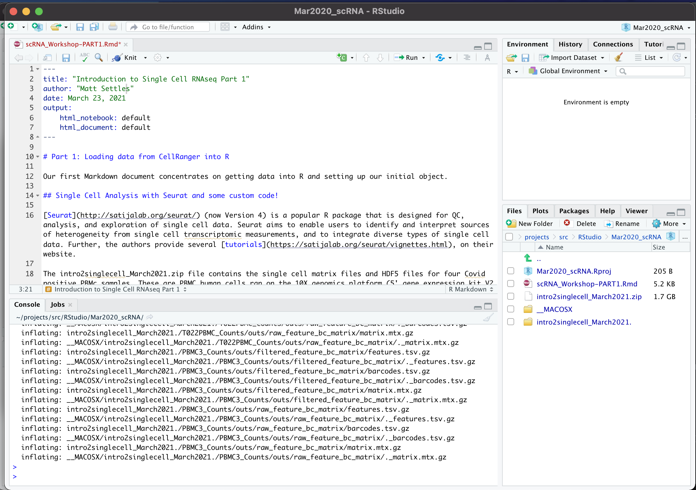

### Create a new RStudio project

Open RStudio and create a new project, for more info see [Using-Projects](https://support.rstudio.com/hc/en-us/articles/200526207-Using-Projects):

*File > New Project > New Directory > New Project*

Name the new directory (e.g. single_cell_makerere), and check "use renv with this project" if present.

Run the following commands to set some options and make sure the packages we need for this workshop are installed and if not install them. We attempt to load them all at the end, please verify they all loaded correctly.

Some of the packages below require a working installation of gfortran, on an Apple Mac this could be an issue, look at this [page for Mac OSX](https://mac.r-project.org/tools/) for additional help.

**SUGGESTION** Do not copy past them all, some require input, so install/check them 1 at a time.

**In the R console** run the following commands:
```r
if (!requireNamespace("BiocManager", quietly = TRUE)){
    install.packages("BiocManager")
}

if (!any(rownames(installed.packages()) == "rmarkdown")){
  BiocManager::install("rmarkdown")
}

if (!any(rownames(installed.packages()) == "tinytex")){
  BiocManager::install("tinytex")
}

if (!any(rownames(installed.packages()) == "Seurat")){
  BiocManager::install("Seurat")
}

if (!any(rownames(installed.packages()) == "hdf5r")){
  BiocManager::install("hdf5r")
}

if (!any(rownames(installed.packages()) == "knitr")){
  BiocManager::install("knitr")
}

if (!any(rownames(installed.packages()) == "kableExtra")){
  BiocManager::install("kableExtra")
}

if (!any(rownames(installed.packages()) == "ggplot2")){
  BiocManager::install("ggplot2")
}

if (!any(rownames(installed.packages()) == "dplyr")){
  BiocManager::install("dplyr")
}

if (!any(rownames(installed.packages()) == "reshape2")){
  BiocManager::install("reshape2")
}

if (!any(rownames(installed.packages()) == "biomaRt")){
  BiocManager::install("biomaRt")
}

if (!any(rownames(installed.packages()) == "org.Hs.eg.db")){
  BiocManager::install("org.Hs.eg.db")
}

if (!any(rownames(installed.packages()) == "limma")){
  BiocManager::install("limma")
}

if (!any(rownames(installed.packages()) == "topGO")){
  BiocManager::install("topGO")
}

if (!any(rownames(installed.packages()) == "sva")){
  BiocManager::install("sva")
}

if (!any(rownames(installed.packages()) == "scran")){
  BiocManager::install("scran")
}

if (!any(rownames(installed.packages()) == "remotes")){
  BiocManager::install("remotes")
}

if (!any(rownames(installed.packages()) == "DoubletFinder")){
  remotes::install_github('chris-mcginnis-ucsf/DoubletFinder')
}

## All of these should now load without error.

library(rmarkdown)
library(tinytex)
library(Seurat)
library(hdf5r)
library(knitr)
library(kableExtra)
library(ggplot2)
library(dplyr)
library(reshape2)
library(biomaRt)
library(limma)
library(topGO)
library(org.Hs.eg.db)
library(sva)
library(scran)

sessionInfo()
```

### Download the template Markdown workshop document PART1 and open it.

In the R console run the following command to download part 1 of data analysis
```r
download.file("https://raw.githubusercontent.com/msettles/2022-Uganda-Single-Cell-RNA-Seq-Analysis/main/data_analysis/scRNA_Workshop-PART1.Rmd", "scRNA_Workshop-PART1.Rmd")
```

### Download the data for the workshop, extract it.

In the R console run the following command to download and extract the dataset (approximately 160MB file).

```r
options(timeout=3000)
download.file("https://bioshare.bioinformatics.ucdavis.edu/bioshare/download/feb28v7lew62um4/expression_data_cellranger.zip", "expression_data_cellranger.zip")
system("unzip expression_data_cellranger.zip") # works in Linux and Mac, not sure about Windows"
```

**This way of downloading the file might be very slow (could take > 1hr) and produce issues. Another way to download the file directly from the [web](https://bioshare.bioinformatics.ucdavis.edu/bioshare/view/feb28v7lew62um4/).**


If the system command didn't work to extract the zip file, navigate to the RStudio project folder you downloaded the data in and manually unzip the archive file.

### Edit the file YAML portion

The top YAML (YAML ain't markup language) portion of the doc tells RStudio how to parse the document.

<pre><code>---
title: "Introduction to Single Cell RNAseq Part 1"
author: your_name
date: current_date
output:
    html_notebook: default
    html_document: default
---</code></pre>


Your RStudio should look something like this




Now spend a few minutes navigating through our data. How may samples are there? Find the hdf5 file and the matrix files. View the HTML files and discuss.
